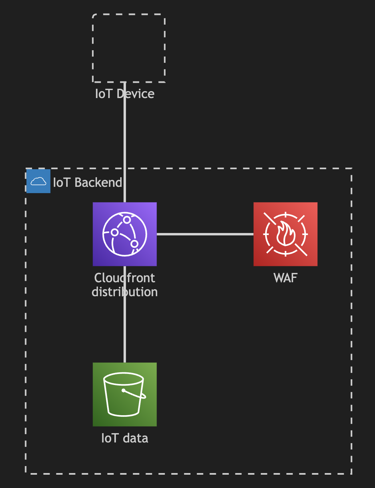

# Fingerprint WAFv2

This is a simple example of AWS WAFv2 rules that can be used to
implement an allowlist using [JA3 or JA4 TLS client
fingerprinting](https://docs.aws.amazon.com/AmazonCloudFront/latest/DeveloperGuide/adding-cloudfront-headers.html#tls-related-versions)

The terraform in `main.tf` manages a Cloudfront distribution with an S3 origin
and attaches a WAFv2 Web ACL to the distribution that implements the fingerprint-based
allowlist.

If the JA3 fingerprint value of the client matchs either `375c6162a492dfbf2795909110ce8424`
or `773906b0efdefa24a7f2b8eb6985bf37` then the request will be passed to the origin. If the
JA3 fingerprint value is not present or it matches `06c5844b8643740902c45410712542e0` the
WAFv2 Web ACL will block the request, responding with a Status 403 response.

## Architecture

