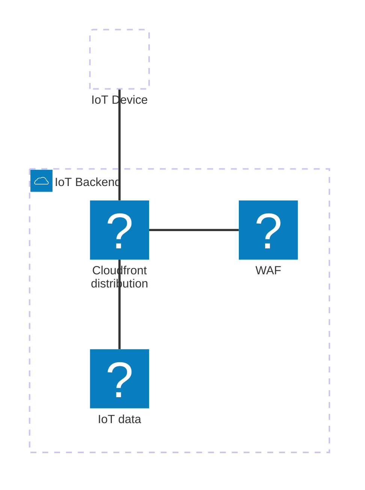

## WAF solution architecture

```mermaid
architecture-beta
    group iot_backend(cloud)[IoT Backend]
    service iot_data(logos:aws-s3)[IoT data] in iot_backend
    service cloudfront(logos:aws-cloudfront)[Cloudfront distribution] in iot_backend
    service waf(logos:aws-waf)[WAF] in iot_backend
    
    service device1[IoT Device]

    iot_data:T -- B:cloudfront
    waf:L -- R:cloudfront
    device1:B -- T:cloudfront
```